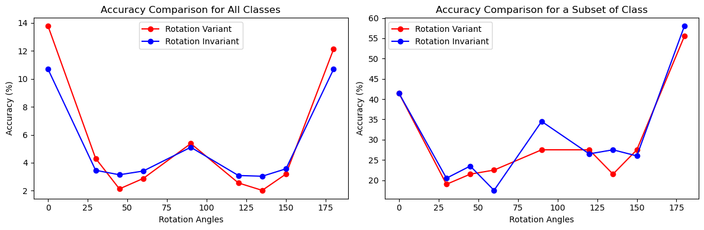
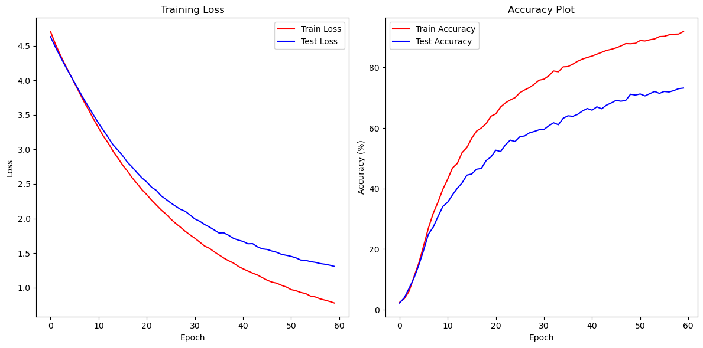
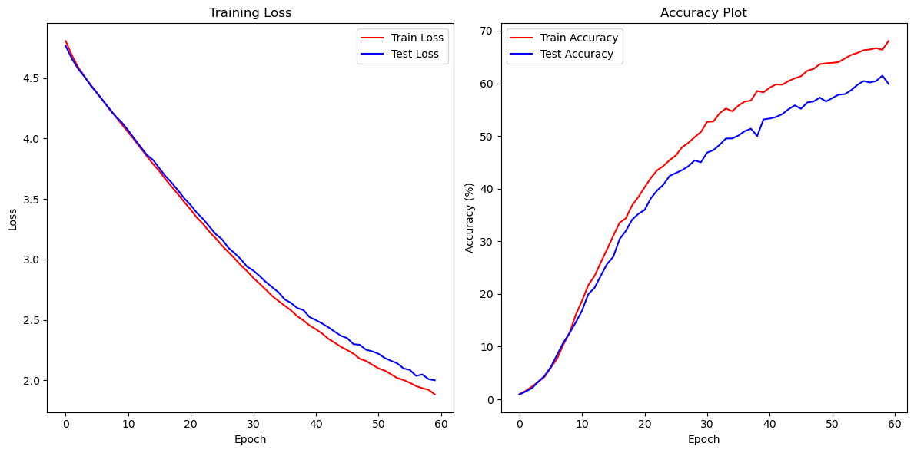

# Assignment 1: Texture Classification and CNN Fine-Tuning

This assignment studies two image classification settings:

1. Texture classification on the Describable Textures Dataset (DTD) using Local Binary Pattern (LBP) descriptors and a 1-nearest-neighbor classifier.
2. Sketch image classification using a pre-trained ResNet-18, comparing full fine-tuning with a BatchNorm-only adaptation strategy.

The experiments are implemented in Jupyter notebooks with reusable helper code in `src/`. The report PDF and saved plots in `Ouput/` summarize the final observations.

## Problem Solved

### 1. LBP-Based Texture Classification

The first part implements LBP feature extraction for texture images and evaluates whether the descriptors can classify textures under rotation.

The tasks are:

- Extract standard LBP features from grayscale DTD images.
- Classify textures using a 1-NN classifier over normalized 256-bin LBP histograms.
- Rotate test images by different angles and measure how standard LBP behaves.
- Implement rotation-invariant LBP by mapping every 8-bit LBP code to its minimum rotated binary value.
- Compare standard and rotation-invariant LBP on all DTD classes and on a smaller 5-class subset.

### 2. CNN Fine-Tuning for Sketch Classification

The second part fine-tunes an ImageNet pre-trained ResNet-18 on a sketch classification dataset.

The tasks are:

- Replace the final ResNet-18 fully connected layer for 99 sketch classes.
- Train the network for 60 epochs using SGD and cross-entropy loss.
- Plot training/test loss and accuracy.
- Visualize feature maps from selected ResNet layers before and after fine-tuning.
- Compare full model fine-tuning with updating only BatchNorm parameters and the final classifier.

## Repository Structure

```text
Assignment 1/
+-- Data/
|   +-- DTD/                  # Texture dataset, 47 classes
|   |   +-- train/            # 1880 training images
|   |   +-- test/             # 1880 test images
|   +-- Sketch_data/          # Sketch classification dataset
|       +-- train/            # 3465 training images, 99 classes
|       +-- test/             # 1082 test images
+-- Ouput/                    # Saved result plots and visualizations
+-- Papers/                   # Reference paper for LBP
+-- src/
|   +-- lbp.py                # LBP model wrapper and 1-NN classifier
|   +-- utilities.py          # LBP computation, data loading, metrics, confusion matrix
|   +-- finetune.py           # CNN training/evaluation helpers
|   +-- __init__.py
+-- LBP_analysis.ipynb        # LBP experiments on DTD
+-- finetune_CNN_analysis.ipynb
+-- Problem Statement.pdf
+-- Report.pdf
```

Note: the output folder is named `Ouput` in the repository.

## Methods

### LBP Pipeline

- Images are loaded in grayscale.
- For each non-border pixel, an 8-neighbor LBP code is computed by thresholding neighbors against the center pixel.
- Each image is represented by a normalized 256-bin histogram of LBP codes.
- For rotation-invariant LBP, each code is replaced by the minimum value among all 8 circular bit rotations.
- Classification is done using 1-NN with Euclidean distance between histograms.

Key implementation files:

- `src/utilities.py`: `compute_lbp_features`, `load_train_test_data`, `getAccuracy`, `createConfusionMatrix`
- `src/lbp.py`: `LBP.fit`, `LBP.predict`, `classifier_1nn`

### CNN Pipeline

- Base model: `torchvision.models.resnet18(weights='IMAGENET1K_V1')`
- Final layer changed to output 99 classes.
- Batch size: 32
- Learning rate: 0.001
- Epochs: 60
- Optimizer: SGD
- Loss: cross-entropy

Two training settings are evaluated:

- Full fine-tuning: all ResNet-18 parameters are trainable.
- BatchNorm-only adaptation: only BatchNorm parameters and the final classifier are trainable.

## Results and Observations

### LBP on All 47 DTD Classes

The standard LBP model reached 13.78% accuracy without rotation. This is low in absolute terms, but clearly above a random baseline of about 2.13% for 47 classes.

| Test rotation | Standard LBP | Rotation-invariant LBP |
| --- | ---: | ---: |
| 0 deg | 13.78% | 10.69% |
| 30 deg | 4.31% | 3.46% |
| 45 deg | 2.13% | 3.14% |
| 60 deg | 2.87% | 3.40% |
| 90 deg | 5.37% | 5.11% |
| 120 deg | 2.55% | 3.09% |
| 135 deg | 2.02% | 3.03% |
| 150 deg | 3.19% | 3.56% |
| 180 deg | 12.13% | 10.69% |

Observations:

- Standard LBP works best when train and test orientations match.
- Accuracy drops strongly for intermediate rotations, showing that standard LBP is rotation-sensitive.
- Rotation-invariant LBP reduces the number of active sample features from 256 to 36, making the descriptor more compact.
- Rotation-invariant LBP improves some rotated cases, especially around 45, 60, 120, 135, and 150 degrees, but it is not uniformly better on this dataset.
- The t-SNE visualization shows heavy overlap among the 47 DTD classes, which explains the low 1-NN accuracy.



### LBP on a 5-Class Subset

The same experiment was repeated on a smaller subset of 5 texture classes.

Observations:

- Accuracy improved substantially because the classes are less crowded than the full 47-class setting.
- At 0 degrees, both standard and rotation-invariant LBP reached 41.50%.
- At 180 degrees, standard LBP reached 55.50% and rotation-invariant LBP reached 58.00%.
- Rotation-invariant LBP gave better results for several rotated angles, including 30, 45, 90, 135, and 180 degrees.

### CNN Fine-Tuning on Sketch Data

Full ResNet-18 fine-tuning gave the strongest result.

| Method | Final train accuracy | Final test accuracy |
| --- | ---: | ---: |
| Full ResNet-18 fine-tuning | 91.9% | 73.2% |
| BatchNorm-only + classifier | 68.1% | 59.9% |

Observations:

- Full fine-tuning steadily reduced both train and test loss across 60 epochs.
- Test accuracy reached 73.2%, showing that ImageNet features transfer well to the sketch dataset after fine-tuning.
- BatchNorm-only adaptation trained faster and improved steadily, but its final test accuracy was lower than full fine-tuning.
- Feature map visualizations from `layer1`, `layer2`, and `layer4` show how fine-tuning changes the internal activations from generic ImageNet responses to sketch-specific responses.





## Output Files

Important plots in `Ouput/`:

- `acc_comparison.png`: Standard vs rotation-invariant LBP accuracy for all classes and the 5-class subset.
- `tSNE.png`: t-SNE visualization of LBP features, showing class overlap.
- `SMLBP_sample.png`, `RILBP_sample.png`: Sample LBP maps and histograms.
- `SMLBP_sample_CM.png`, `RILBP_sample_CM.png`: Confusion matrices for LBP experiments.
- `acc_ft.png`: Loss and accuracy curves for full ResNet-18 fine-tuning.
- `acc_bn.png`: Loss and accuracy curves for BatchNorm-only training.
- `layer1_og.png`, `layer2_og.png`, `layer4_og.png`: Feature maps from the original pre-trained ResNet-18.
- `layer1_ft.png`, `layer2_ft.png`, `layer4_ft.png`: Feature maps after fine-tuning.

## How to Run

Install the required Python packages:

```bash
pip install numpy matplotlib pillow scikit-learn tqdm torch torchvision
```

Run the notebooks from inside the `Assignment 1/` directory:

```bash
jupyter notebook LBP_analysis.ipynb
jupyter notebook finetune_CNN_analysis.ipynb
```

The notebooks assume the dataset folders are available under `Data/` with the same train/test structure shown above.
