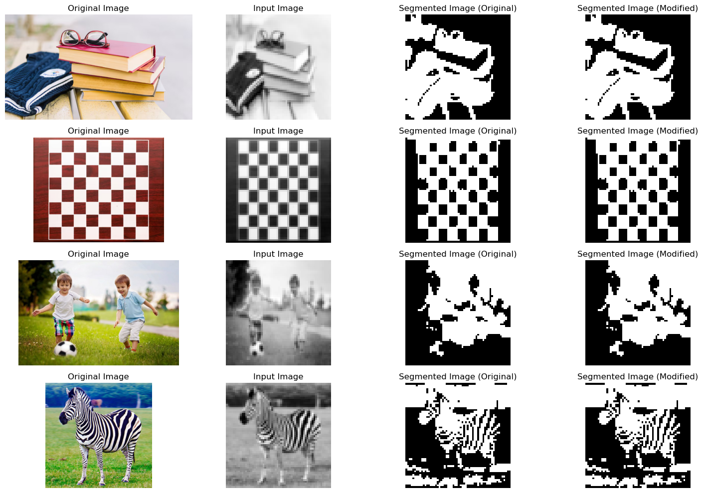
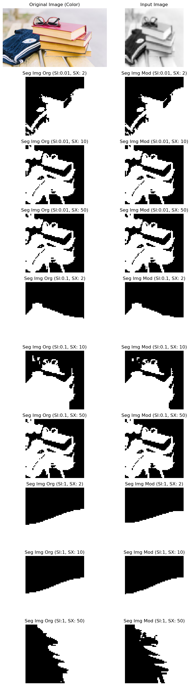
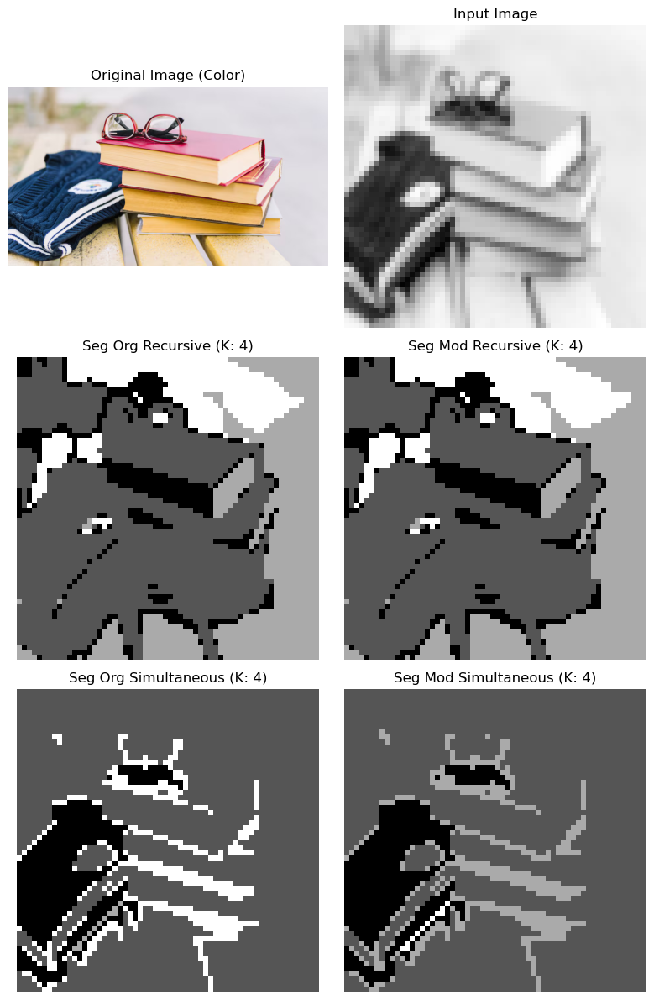
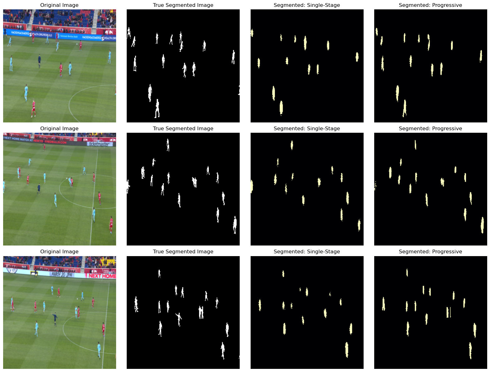

# Assignment 2: Image Segmentation

This assignment studies image segmentation with two complementary approaches:

1. **Graph-based segmentation using Normalized Cuts (N-Cut)** on natural images.
2. **Semantic segmentation using an encoder-decoder neural network** for football player masks.

The work compares classical graph partitioning choices, studies N-Cut parameter sensitivity, and evaluates two decoder designs built on top of a pretrained ResNet18 encoder.

## Problem Solved

### 1. Graph-Based Image Segmentation with Normalized Cuts

The first part implements Normalized Cut segmentation by representing an image as a graph where pixels are nodes and pairwise affinities are edge weights. The assignment explores:

- Original N-Cut weights based on intensity and spatial distance.
- Modified/improvised weights that also include edge information from a Sobel edge map.
- The effect of changing the standard deviation parameters `sigmaI` and `sigmaX`.
- Recursive two-way partitioning versus simultaneous K-way partitioning using K-Means on eigenvectors.

### 2. Semantic Segmentation with Encoder-Decoder Networks

The second part trains semantic segmentation models to separate football players from the background. A pretrained ResNet18 encoder extracts multi-scale image features, and two decoder variants are compared:

- **Single-stage decoder:** directly upsamples the deepest encoder feature map.
- **Progressive decoder:** upsamples gradually and uses intermediate encoder features through skip connections.

The models are evaluated using pixel accuracy and mean Intersection over Union (mIoU).

## Repository Structure

```text
Assignment 2/
|-- EncoderDecoder_Segmentation.ipynb   # Training and evaluation notebook for semantic segmentation
|-- nCut_Segmentation.ipynb             # N-Cut experiments and visual comparisons
|-- Problem Statement.pdf               # Assignment problem statement
|-- Report.pdf                          # Detailed report and observations
|-- data/
|   |-- data_Ncut/                      # Sample images for N-Cut experiments
|   |   |-- books.jpg
|   |   |-- chess.jpg
|   |   |-- football.jpg
|   |   `-- zebra.jpg
|   `-- data_encdec/                    # Football-player semantic segmentation data
|       |-- annotations/
|       |   `-- instances_default.json  # COCO-style polygon annotations
|       |-- images/                     # 512 football frame images
|       `-- train_test_split.json       # Train/test split
|-- Output/
|   |-- ED_compare.png
|   |-- ED_Prog.png
|   |-- ED_Single.png
|   |-- nCut_parameter_analysis.png
|   |-- nCut_Recursive_vs_simultaneous.png
|   `-- nCut_weight_org_vs_mod.png
`-- src/
    |-- dataset.py                      # PyTorch dataset for COCO-style football masks
    |-- encoder.py                      # ResNet18 encoder
    |-- decoder.py                      # Single-stage and progressive decoders
    |-- masterSemantic.py               # Combined encoder-decoder model
    |-- normalizedCut.py                # Normalized Cut implementation
    |-- utilities.py                    # Training, evaluation, IoU, and visualization helpers
    `-- semanticEval.py                 # Metric class placeholder
```

## Dataset Details

### N-Cut Data

The N-Cut experiments use four images: books, chess board, football scene, and zebra. Each image is resized before graph construction to keep the affinity matrix computationally manageable.

### Encoder-Decoder Data

The semantic segmentation dataset contains football match frames with COCO-style polygon annotations for the `person` class.

- Total images: **512**
- Total annotations: **7686**
- Train images: **409**
- Test images: **103**
- Class labels: background and person/player

## Methods

### Normalized Cut

The N-Cut implementation builds a weighted graph using:

- Pixel intensity similarity.
- Spatial proximity.
- Optional edge similarity from Sobel edge responses.

It then solves the generalized eigenvalue problem for the graph Laplacian and partitions the image using eigenvectors. For K-way segmentation, the code supports both recursive splitting and simultaneous clustering with K-Means.

### Encoder-Decoder Segmentation

The semantic segmentation model uses:

- Pretrained `ResNet18` as the encoder.
- Cross-entropy loss.
- Adam optimizer with learning rate `1e-4`.
- Image resize to `256 x 256`.
- Training for `15` epochs.
- Evaluation with pixel accuracy and mIoU.

## Results and Observations

### N-Cut: Original vs Modified Weights



The original and modified weights produce broadly similar segmentations, but the edge-aware modification helps preserve stronger boundaries in structured images such as the chess board and zebra. The results also show that classical N-Cut is sensitive to texture, clutter, and local contrast.

### N-Cut: Parameter Analysis



Changing `sigmaI` and `sigmaX` significantly affects the segmentation:

- Small `sigmaI` values preserve more intensity-sensitive details.
- Larger `sigmaI` values merge regions more aggressively and can collapse the output into coarse blobs.
- Smaller `sigmaX` values emphasize local neighborhoods.
- Larger `sigmaX` values allow more global grouping but may merge unrelated regions.

### N-Cut: Recursive vs Simultaneous K-Way Partitioning



Recursive partitioning gives larger and more coherent region blocks, while simultaneous K-Means partitioning over eigenvectors captures more fragmented, edge-driven structures. The choice depends on whether the goal is coarse object-level grouping or finer region separation.

### Encoder-Decoder Semantic Segmentation



Both encoder-decoder models identify football players against the field background. The progressive decoder gives more complete masks and recovers more player instances in the visual examples because it combines deep semantic features with intermediate spatial features.

| Model | Test Pixel Accuracy | Test mIoU |
|---|---:|---:|
| Single-stage decoder | 98.70% | 0.7063 |
| Progressive decoder | 99.15% | 0.7992 |

The progressive decoder performs better than the single-stage decoder, improving both pixel accuracy and mIoU. The mIoU improvement is especially important because the player class occupies a small fraction of each image, so pixel accuracy alone can be misleading.

## How to Run

Install the required Python packages:

```bash
pip install numpy matplotlib scikit-image scipy scikit-learn torch torchvision opencv-python pillow tqdm jupyter
```

Run the notebooks from inside the `Assignment 2` directory:

```bash
jupyter notebook nCut_Segmentation.ipynb
jupyter notebook EncoderDecoder_Segmentation.ipynb
```

The notebooks use the local `data/` and `src/` folders and reproduce the visual comparisons saved in `Output/`.

## Key Takeaways

- Normalized Cut is useful for unsupervised segmentation, but its output depends heavily on affinity design and parameter selection.
- Adding edge information can improve boundary awareness, especially on images with strong structural edges.
- Recursive and simultaneous K-way N-Cut produce different styles of segmentation: coarse hierarchical regions versus finer eigenvector clusters.
- For semantic segmentation, progressive decoding with skip connections outperforms direct single-stage upsampling.
- mIoU is a more informative metric than pixel accuracy for this dataset because the foreground player pixels are sparse compared with the background.
