# Assignment 3: Image Denoising and Low-Light Enhancement

This assignment studies two image restoration problems:

1. **Image denoising using BM3D** on a noisy Cameraman image.
2. **Low-light image enhancement using Zero-DCE** on LOL dataset image pairs and self-captured smartphone images.

The work compares BM3D stages, analyzes noise-level sensitivity, and evaluates how image-specific fine-tuning changes Zero-DCE enhancement quality.

## Problem Solved

### 1. BM3D Image Denoising

The first part applies BM3D to remove additive noise from the Cameraman image. The assignment explores:

- BM3D Stage 1 hard-thresholding output.
- Full BM3D Stage 2 output using hard-thresholding followed by Wiener filtering.
- MSE variation as the input noise variance increases.
- A comparison between the standard Stage 2 Wiener filtering step and a second hard-thresholding pass.

### 2. Low-Light Enhancement with Zero-DCE

The second part uses a Zero-DCE-style enhancement network for low-light image correction. The assignment evaluates:

- A pretrained Zero-DCE model on low-light LOL images.
- Image-specific fine-tuning using unsupervised enhancement losses.
- Quantitative comparison using PSNR and SSIM against LOL normal-light ground truth images.
- Qualitative enhancement on low-light smartphone images captured manually.

## Repository Structure

```text
Assignment 3/
|-- Problem 1.ipynb                  # BM3D denoising experiments
|-- Problem 2.ipynb                  # Zero-DCE enhancement and fine-tuning experiments
|-- model.py                         # Zero-DCE enhancement network
|-- Myloss.py                        # Zero-DCE loss functions
|-- Problem Statement.pdf            # Assignment problem statement
|-- TejashMore27077_Report.pdf       # Detailed report and observations
|-- data/
|   |-- cameramanclean.png           # Clean Cameraman image
|   |-- cameramannoisy.png           # Noisy Cameraman image
|   |-- LOL/
|   |   |-- train/                   # Low-light LOL input images
|   |   `-- test/                    # Normal-light LOL ground truth images
|   `-- camera/                      # Self-captured low-light smartphone images
`-- output/
    |-- task1_1.png                  # BM3D Stage 1 vs Stage 2 comparison
    |-- task1_2.png                  # MSE vs input noise variance
    |-- task1_3.png                  # Wiener Stage 2 vs repeated hard-thresholding
    |-- task2_1a.png                 # LOL result for image 00703
    |-- task2_1b.png                 # LOL result for image 00718
    |-- task2_1c.png                 # LOL result for image 00731
    |-- task2_1d.png                 # LOL result for image 00765
    |-- task2_1e.png                 # LOL result for image 00783
    |-- task2_2a.png                 # Smartphone enhancement example 1
    |-- task2_2b.png                 # Smartphone enhancement example 2
    `-- task2_2c.png                 # Smartphone enhancement example 3
```

## Methods

### BM3D

BM3D groups similar image patches into 3D blocks and denoises them collaboratively. The experiments use the `bm3d` Python package and evaluate denoising quality using mean squared error (MSE).

The notebook compares:

- **Stage 0:** noisy input image.
- **Stage 1:** hard-thresholding only.
- **Stage 2:** hard-thresholding followed by Wiener filtering.
- **Alternative Stage 2:** a second hard-thresholding pass instead of Wiener filtering.

### Zero-DCE

The enhancement model in `model.py` predicts pixel-wise curve parameters and applies iterative curve transformations to brighten low-light images. The loss functions in `Myloss.py` include:

- Spatial consistency loss.
- Exposure control loss.
- Color constancy loss.
- Total variation loss on enhancement curves.
- Additional saturation/perceptual loss utilities.

In `Problem 2.ipynb`, each low-light image is first enhanced using pretrained weights and then fine-tuned for 30 epochs on that single image using the unsupervised Zero-DCE losses.

## Results and Observations

### BM3D Stage 1 vs Stage 2

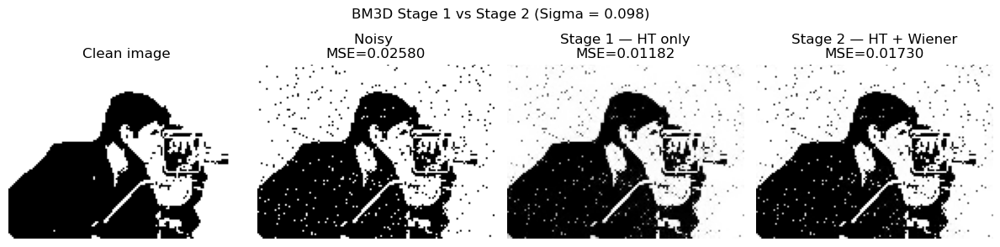

For the provided noisy Cameraman image, Stage 1 hard-thresholding reduces MSE from **0.025800** to **0.011818**. The full Stage 2 result gives MSE **0.017297** in this run, which is worse than Stage 1 for this particular image/noise setting.

| Output | MSE |
|---|---:|
| Noisy image | 0.025800 |
| Stage 1: hard-thresholding | 0.011818 |
| Stage 2: hard-thresholding + Wiener filtering | 0.017297 |

### BM3D Noise Variance Analysis

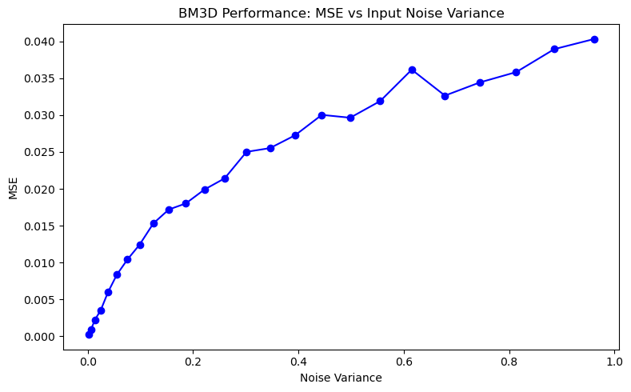

As the input noise variance increases, the denoised output MSE also increases. BM3D performs well at lower noise levels, but its reconstruction quality degrades steadily for heavy noise because patch matching becomes less reliable.

### Wiener Filtering vs Repeated Hard-Thresholding

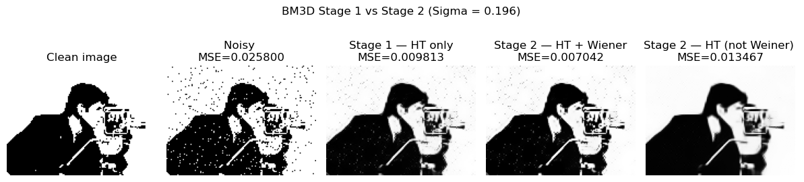

For the higher-noise experiment with sigma `50/255`, Wiener filtering performs best. Replacing the Wiener stage with another hard-thresholding pass gives a blurrier result and higher error.

| Output | MSE |
|---|---:|
| Noisy image | 0.025800 |
| Stage 1: hard-thresholding | 0.009813 |
| Stage 2: hard-thresholding + Wiener filtering | 0.007042 |
| Stage 2: repeated hard-thresholding | 0.013467 |

### Zero-DCE on LOL Images

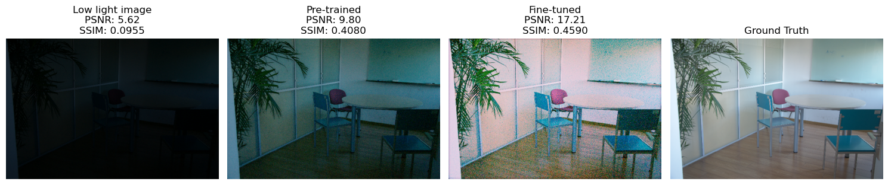

The pretrained model consistently brightens low-light inputs and usually improves PSNR and SSIM over the original low-light images. Image-specific fine-tuning improves one very dark image substantially, but in most LOL examples it over-enhances the image, introduces color shifts/noise, and reduces PSNR/SSIM compared with the pretrained result.

| Image | Pretrained PSNR | Pretrained SSIM | Fine-tuned PSNR | Fine-tuned SSIM |
|---|---:|---:|---:|---:|
| 00703 | 9.80 | 0.4080 | 17.21 | 0.4590 |
| 00718 | 16.80 | 0.7690 | 12.33 | 0.6308 |
| 00731 | 25.76 | 0.8289 | 13.42 | 0.7077 |
| 00765 | 17.30 | 0.6690 | 10.52 | 0.4322 |
| 00783 | 15.66 | 0.7149 | 12.79 | 0.5995 |

Additional LOL visual comparisons:

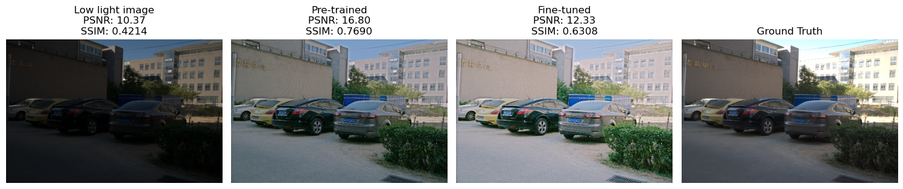

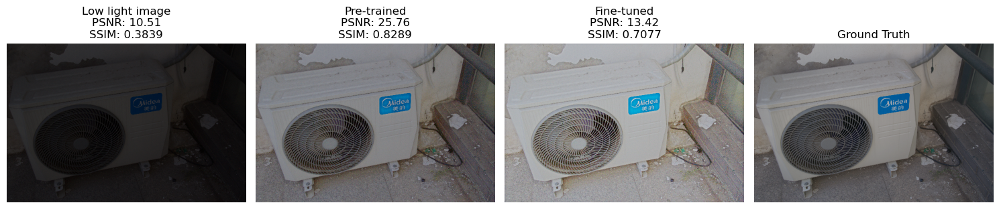

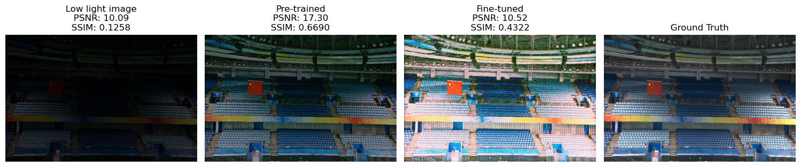

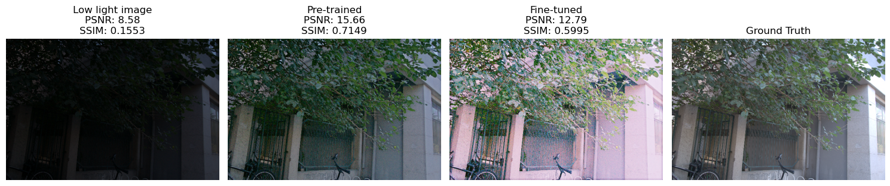

### Zero-DCE on Smartphone Images

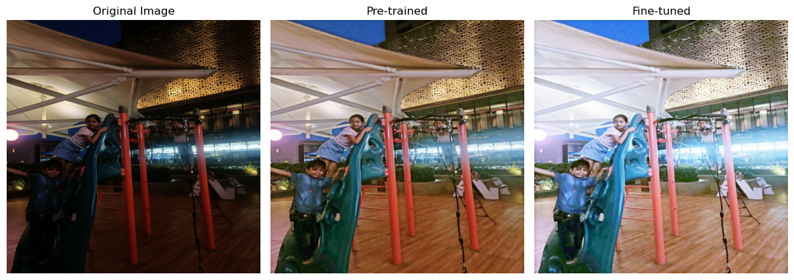

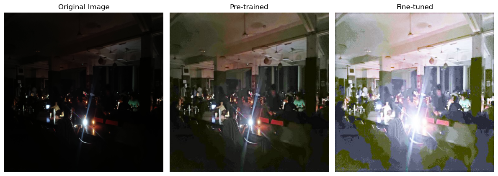

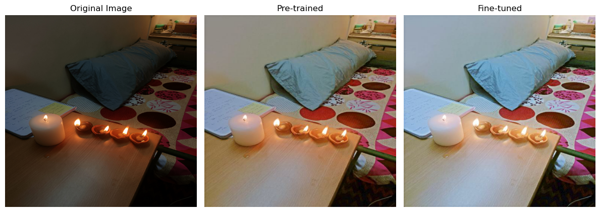

On real smartphone images, both pretrained and fine-tuned outputs reveal details hidden in dark regions. Fine-tuning generally increases brightness more aggressively, which can be useful for visibility but may overexpose bright light sources and flatten natural contrast.

## How to Run

Install the required Python packages:

```bash
pip install numpy matplotlib pillow bm3d torch torchvision scikit-image jupyter
```

Run the notebooks from inside the `Assignment 3` directory:

```bash
jupyter notebook "Problem 1.ipynb"
jupyter notebook "Problem 2.ipynb"
```

`Problem 2.ipynb` expects pretrained Zero-DCE weights at:

```text
Zero-DCE_code/snapshots/Epoch99.pth
```

Place the pretrained checkpoint there before running the Zero-DCE experiments.

## Key Takeaways

- BM3D significantly reduces noise in the Cameraman image, but the best stage depends on the noise setting.
- Output MSE increases with input noise variance, showing the practical limit of patch-based denoising at very high noise levels.
- Wiener filtering is more effective than repeating hard-thresholding in the higher-noise BM3D experiment.
- Pretrained Zero-DCE improves brightness and structure for most low-light images.
- Image-specific fine-tuning can help extremely dark images, but it may over-enhance normal LOL examples and reduce PSNR/SSIM.
- Qualitative smartphone results show that Zero-DCE is useful for visibility enhancement, though exposure control remains important.
